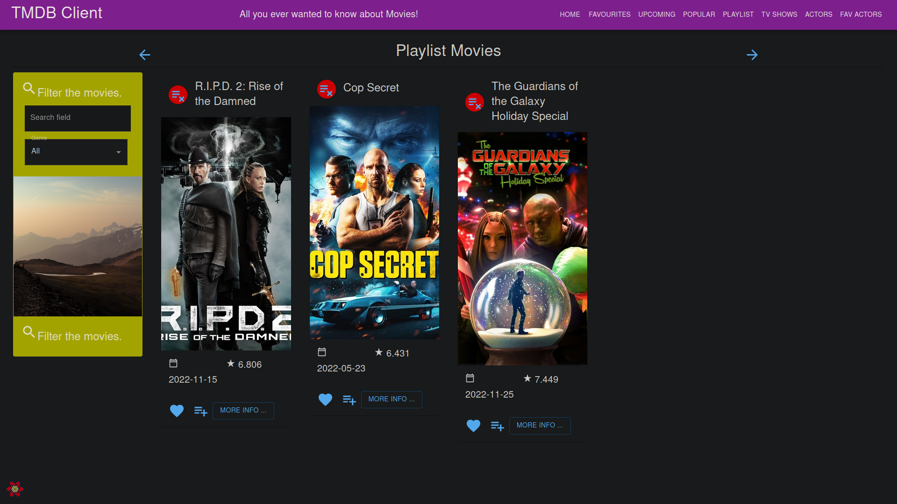
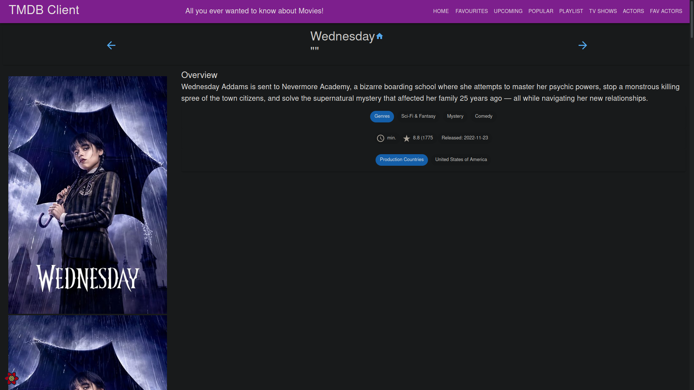
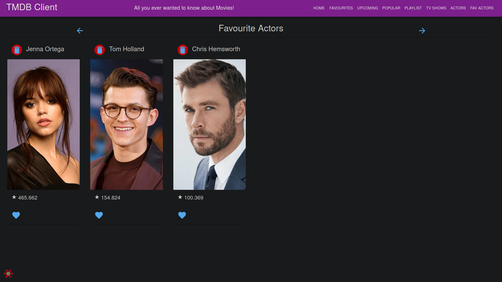

# moviesapp-assignment01-2022


## Description
A react app that utilizes the [TMDB](https://www.themoviedb.org/) api to view movies, tv shows and actors.

## Visuals
### Home Page

### Favourite Movies Page

### Upcoming Movies Page

### Popular Movies Page

### Movies Playlist Page

### Popular Tv Shows Page

### Tv Shows Details Page

### Actors Page

### Favourite Actors Page


## Usage
To install the dependencies use the command:
``` sh
npm install
```

To start the development server run the following command from inside the project directory:
``` sh
npm start
```

To run the storybook of the project use:
``` sh
npm run storybook
```

## Roadmap
* [x] UI - New Views/pages
  * [x] Actors
  * [x] Most Popular Movies
  * [x] Tv Series
* [x] Routing
  * [x] One additional parameterized URL (Tv Show details)
* [x] Extensive data hyperlinking 
* [x] Data model - Full Caching Support
* [ ] Routing - Basic authentication
  * [ ] Private and Public Routes 
  * [ ] Premium functionality
* [x] Storybook support
  * [x] Actors Page
  * [x] Tv Shows Page
  * [x] Tv Show Details
* [ ] Functionality
  * [x] Favourite Actors
  * [ ] Extended Filtering and/or Sorting
  * [ ] Ordered Favourites
  * [x] Movie Playlists
* [ ] Pagination
* [ ] 3rd party authentication e.g. Firebase
* [ ] Backend persistence - e.g. TMDB Lists, Firebase
* [ ] Rich Feature Set

